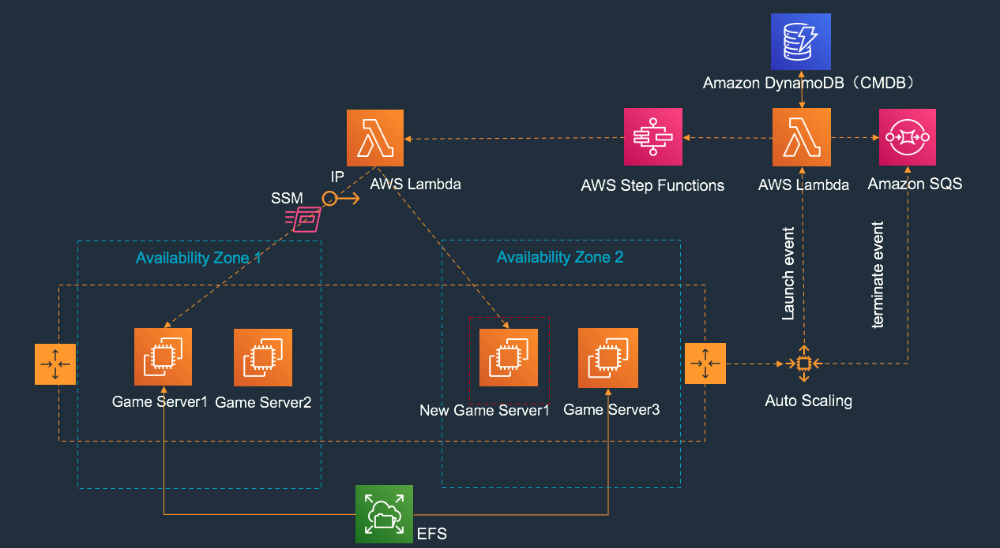

# ec2_high_available

## dynamodb table design(hatable)

columname | type 
--- | --- 
appname | string
curr_instance|string
eip|string
pip|string

## sqs desgin
hasqs.fifo

## step function

## autoscaling group

